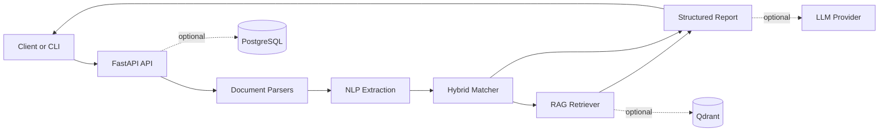

# Resume Vacancy AI Agent

[](https://github.com/grtrz/resume-vacancy-ai-agent/actions/workflows/ci.yml)

Production-oriented FastAPI service for matching resumes against vacancies using structured NLP
extraction, hybrid scoring, semantic similarity, retrieval-grounded recommendations, and optional
resume bullet rewriting.

## Overview

Resume Vacancy AI Agent converts resume and vacancy text into normalized skill and experience
profiles, compares them with a deterministic scoring pipeline, and returns a structured matching
report suitable for ATS-style screening, recruiter tooling, and resume optimization workflows.

The service is designed as an API-first backend. It supports raw text matching and file uploads for
PDF, DOCX, and TXT resumes without storing uploaded files on disk.

## Key Features

- Text and file-based resume matching endpoints
- PDF, DOCX, and TXT parsing
- Skill, framework, tool, responsibility, project, and experience extraction
- Hybrid scoring with skill overlap, experience fit, keyword relevance, coverage bonus, and semantic similarity
- Retrieval-grounded recommendations from a local knowledge base
- Optional LLM-backed bullet rewriting with deterministic fallback behavior
- Structured request logging and workflow timing metadata
- Docker Compose setup with API, PostgreSQL, and Qdrant services
- Pytest and Ruff checks in GitHub Actions CI

## Architecture



## Pipeline

1. Parse resume input from text, PDF, DOCX, or TXT.
2. Clean and normalize resume and vacancy text.
3. Extract profile signals such as skills, tools, projects, responsibilities, and experience.
4. Score resume-vacancy fit with deterministic and semantic features.
5. Retrieve relevant improvement examples for missing skills.
6. Build a structured report with scores, gaps, recommendations, and optional rewritten bullets.
7. Record internal workflow timings for observability without logging raw resume or vacancy text.

## Tech Stack

- Python 3.13 target runtime
- FastAPI and Uvicorn
- Pydantic v2
- LangGraph for workflow orchestration
- PyMuPDF and python-docx for document parsing
- sentence-transformers for semantic similarity
- Qdrant client for vector retrieval integration
- PostgreSQL-ready configuration with SQLAlchemy and psycopg
- Pytest, Ruff, and GitHub Actions

## API Endpoints

| Method | Path | Description |
| --- | --- | --- |
| `GET` | `/` | Basic project info with links to `/docs` and `/health` |
| `GET` | `/health` | Service health check |
| `GET` | `/docs` | Swagger UI |
| `POST` | `/reports/match` | Match raw resume text against vacancy text |
| `POST` | `/reports/match-file` | Match an uploaded resume file against vacancy text |

## Quick Start

```powershell
python -m venv .venv
.\.venv\Scripts\Activate.ps1
python -m pip install --upgrade pip
python -m pip install -e ".[dev]"
copy .env.example .env
uvicorn app.main:app --reload
```

Open:

```text
http://127.0.0.1:8000/
http://127.0.0.1:8000/docs
http://127.0.0.1:8000/health
```

## Docker Usage

Build and start the local stack:

```powershell
docker compose up --build
```

The API container runs:

```text
uvicorn app.main:app --host 0.0.0.0 --port 8000
```

PostgreSQL and Qdrant are included for end-to-end local development, but current tests do not
require either service.

Stop the stack:

```powershell
docker compose down
```

## Example Request

Raw text matching:

```bash
curl -X POST http://127.0.0.1:8000/reports/match \
  -H "Content-Type: application/json" \
  -d @- <<'JSON'
{
  "resume_text": "Skills: Python, FastAPI, PostgreSQL, Docker. Experience: 6 years building backend REST APIs.",
  "vacancy_text": "Skills: Python, FastAPI, PostgreSQL. Experience: At least 5 years building backend APIs."
}
JSON
```

File upload matching:

```bash
curl -X POST http://127.0.0.1:8000/reports/match-file \
  -F "resume_file=@examples/sample_resume.txt;type=text/plain" \
  -F "vacancy_text=<examples/sample_vacancy.txt" \
  -F "enable_bullet_rewriting=false"
```

## Example Response

See [examples/sample_report.json](examples/sample_report.json).

```json
{
  "match_score": 91.5,
  "matched_skills": ["fastapi", "postgresql", "python", "rest api"],
  "missing_skills": ["kubernetes"],
  "gaps": [
    {
      "category": "skill",
      "requirement": "kubernetes",
      "recommendation": "Address missing skill 'kubernetes' only if it reflects real experience."
    }
  ]
}
```

## Evaluation

The repository includes a small synthetic evaluation set at
[data/evaluation/resume_vacancy_pairs.json](data/evaluation/resume_vacancy_pairs.json). It covers
strong matches, weak matches, missing skills, experience mismatch, and semantic matches with low
exact skill overlap.

Run the offline evaluator:

```powershell
.\.venv\Scripts\python.exe scripts\evaluate_matching.py
```

The script runs the existing extraction and matching path with deterministic local adapters, prints
per-case results, and reports:

- `score_in_expected_range_rate`
- `missing_skill_recall`
- `matched_skill_precision`
- `average_match_score`

## Manual Evaluation

Manual examples for real-world style NLP and backend ML roles live in
[data/manual_eval](data/manual_eval). Run the included resume against both sample vacancies:

```powershell
.\.venv\Scripts\python.exe scripts\run_manual_eval.py
```

Run a specific resume against one or more vacancies:

```powershell
.\.venv\Scripts\python.exe scripts\run_manual_eval.py `
  data\manual_eval\nlp_middle_resume.txt `
  data\manual_eval\nlp_middle_vacancy.txt `
  data\manual_eval\backend_ml_vacancy.txt
```

The script is deterministic and prints match score, matched skills, missing skills,
gap recommendations, strengthening suggestions, and retrieved examples without calling external APIs.

## Testing and CI

Run local checks:

```powershell
.\.venv\Scripts\python.exe -m pytest
.\.venv\Scripts\python.exe -m ruff check .
.\.venv\Scripts\python.exe -m ruff format --check .
```

CI runs the same test and Ruff checks on `push` and `pull_request`.

## Roadmap

- Persist uploaded resumes, vacancies, and generated reports
- Add database migrations and repository layer
- Expand retrieval with managed Qdrant collections
- Add authenticated API access and rate limits
- Add evaluation datasets for scoring quality
- Add async processing for long-running matching and rewriting jobs

## Limitations

- Matching quality depends on extraction coverage and available semantic model behavior.
- Optional LLM rewriting must be configured explicitly; tests avoid paid API calls.
- Uploaded files are parsed in memory and are not persisted yet.
- PostgreSQL and Qdrant are present for local development but are not required for the current test suite.
- The service is backend-only; no frontend or deployment automation is included yet.
